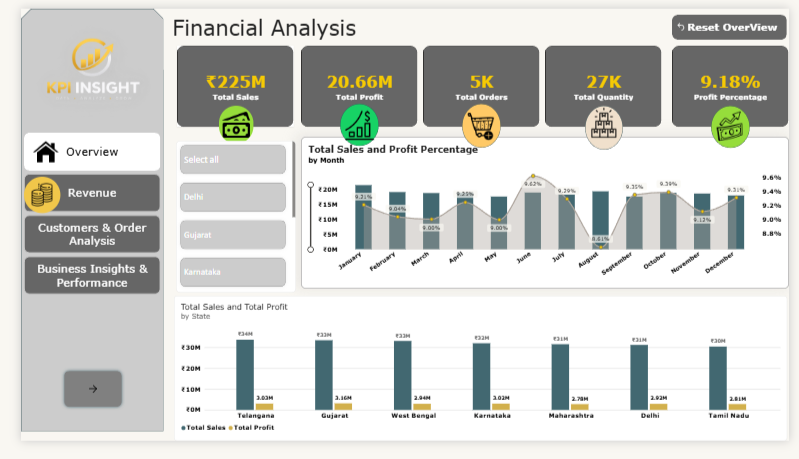
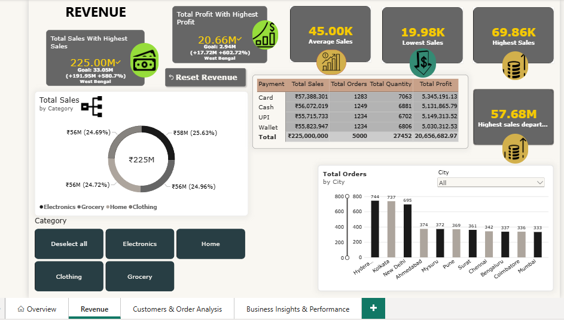
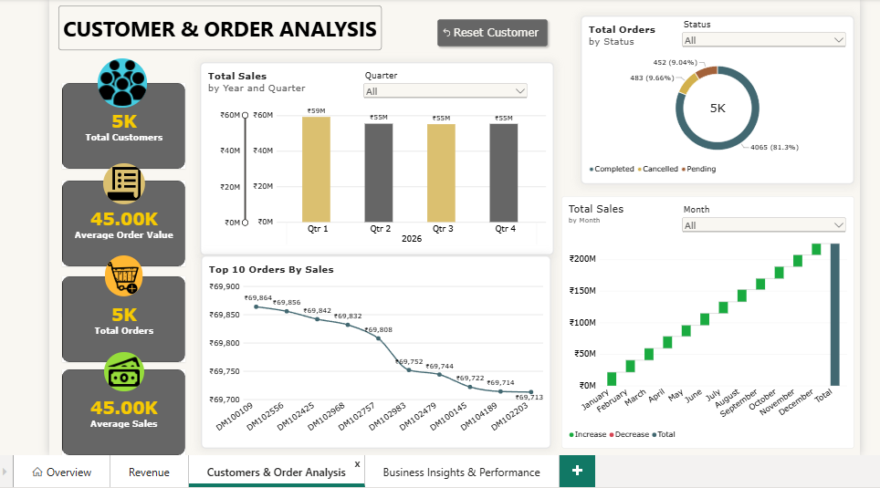

# 📊 DMart Sales & Business Performance Dashboard — Power BI

An interactive **4-page Power BI dashboard** designed to analyze retail sales, revenue, profit, customers, orders, regional performance, targets, and overall business performance across Indian states.

This project demonstrates an end-to-end **Data Analyst / Business Intelligence workflow**, from raw data preparation and transformation to data modeling, DAX analysis, interactive visualization, and business insights.


---

## 📌 Headline Numbers

| Metric | Value |
|---|---:|
| **Total Sales** | ₹225.00M |
| **Total Profit** | ₹20.66M |
| **Profit Percentage** | 9.18% |
| **Total Orders** | 5,000 |
| **Total Quantity Sold** | 27,452 |
| **Target Sales** | ₹200M |
| **Target Achievement** | 112.50% |
| **Sales Variance** | ₹25M |
| **Order Completion Rate** | 81.3% |

---

# 🗂️ Dashboard Overview

## 1️⃣ Overview

The **Overview** page provides a high-level summary of overall business performance.

### Key Metrics

- Total Sales — ₹225.00M
- Total Profit — ₹20.66M
- Total Orders — 5,000
- Total Quantity — 27,452
- Profit Percentage — 9.18%

### Analysis

- Monthly Sales and Profit % trend
- State-wise Sales and Profit
- Interactive State filter

This page provides a quick view of sales, profitability, order volume, quantity sold, and regional performance.



---

## 2️⃣ Revenue Analysis

The **Revenue Analysis** page focuses on detailed sales and revenue performance.

### Key Metrics

- Total Sales
- Total Profit
- Average Sales
- Minimum Sales
- Maximum Sales

### Analysis

- Sales by Category
- Orders by City
- Payment Method summary
- Category-level revenue performance
- City-level order activity

This page helps analyze revenue performance, sales ranges, category performance, city order activity, and customer payment methods.



---

## 3️⃣ Customer & Order Analysis

The **Customer & Order Analysis** page focuses on customer activity and order performance.

### Key Metrics

- Total Customers
- Total Orders — 5,000
- Average Order Value — ₹45.00K
- Average Sales — ₹45.00K

### Analysis

- Sales by Year and Quarter
- Orders by Status
- Top 10 Orders by Sales
- Orders by City
- Sales by Month
- Customer and order performance

### Order Status

The dashboard provides a breakdown of:

- Completed — 4,065
- Cancelled — 483
- Pending — 452

This page helps understand customer activity, order performance, order status, top orders, city-level orders, and sales trends over time.



---

## 4️⃣ Business Insights & Performance

The **Business Insights & Performance** page is the management-focused page of the dashboard.

It combines actual sales performance with targets, achievement, variance, contribution, and city-level performance.

### Key Metrics

- Total Sales — ₹225.00M
- Target Sales — ₹200M
- Achievement — 112.50%
- Sales Variance — ₹25M
- Profit Percentage — 9.18%
- Contribution — 100%

### Analysis

- Sales by City
- Contribution by City
- City Performance
- Target vs Actual Performance
- Achievement Percentage
- Sales Variance
- City Sales Category
- Business Insights

### City Performance

The city performance analysis brings together:

- Sales
- Target
- Achievement %
- Variance
- Contribution %
- Sales Category

This page provides a consolidated view of business performance and helps users understand how different cities contribute to overall sales.


---

# 💡 Key Business Questions

The dashboard was designed to answer important business questions such as:

- How are total sales and profit performing?
- Is the business achieving its sales target?
- What is the difference between actual sales and target?
- Which states and cities generate higher sales?
- Which categories contribute more to revenue?
- What are the minimum and maximum sales values?
- How many customers and orders does the business have?
- Which are the Top 10 orders by sales?
- How are orders distributed by status?
- What is the average order value?
- How does sales performance change by month, quarter, and year?
- How much does each city contribute to total sales?
- Which cities require further performance analysis?

---

# 🛠️ Tools & Technologies

- **Power BI Desktop**
- **Power Query**
- **DAX**
- **Data Modeling**
- **Microsoft Excel**
- **Power BI Service**

---

# 🧹 Data Preparation

Power Query and Excel were used to clean and prepare the sales data before creating the dashboard.

### Data Cleaning

- Removed duplicate records
- Handled errors and blank values
- Corrected data types
- Cleaned and standardized data
- Prepared data for analysis

### Data Transformation

- Created calculated and conditional columns
- Split and merged columns
- Replaced values
- Grouped data
- Merged queries
- Appended queries
- Pivoted and unpivoted data

The prepared dataset was then loaded into Power BI for modeling and analysis.

---

# 📐 DAX & Business Metrics

DAX was used to create the key analytical measures required for the dashboard.

### Core Metrics

- Total Sales
- Total Profit
- Total Orders
- Total Customers
- Total Quantity
- Average Sales
- Average Order Value
- Minimum Sales
- Maximum Sales
- Profit %

### Time-Based Analysis

- Year-to-Date
- Month-to-Date
- Quarter-to-Date
- Monthly performance
- Year and quarter analysis

### Business Performance

- Target Sales
- Achievement %
- Sales Variance
- Contribution %
- City Ranking
- Top N Analysis

---

# 🎛️ Dashboard Features

The dashboard includes:

- Interactive KPI cards
- Slicers and filters
- Monthly trend analysis
- Year and quarter analysis
- City analysis
- State analysis
- Customer analysis
- Order analysis
- Category analysis
- Payment method analysis
- Target vs Actual analysis
- Contribution analysis
- Page navigation
- Page-specific reset buttons
- Interactive Power BI visuals

---

# 🔄 Project Workflow

```text
Raw Sales Data
      ↓
Excel / Power Query
      ↓
Data Cleaning & Transformation
      ↓
Data Modeling
      ↓
DAX Measures
      ↓
Interactive Dashboard
      ↓
Business Insights
      ↓
Power BI Service

# ☁️ Power BI Service

The report was published to **Power BI Service** as part of the project deployment workflow.

The project covers the following Power BI Service concepts:

- Workspace
- Report Publishing
- Semantic Model
- Data Refresh
- Scheduled Refresh Concepts

---

# 📁 Project Files

| File | Description |
|---|---|
| `Sales_Analytics_Dashboard.pbix` | Power BI dashboard |
| `Sales_Data.xlsx` | Sales dataset |
| `Overview.png` | Overview page screenshot |
| `Revenue.png` | Revenue Analysis screenshot |
| `customer-order-analysis.png` | Customer & Order Analysis screenshot |
| `Business Insight & Performance.png` | Business Insights & Performance screenshot |
| `README.md` | Project documentation |

---

# 🚀 How to View

1. Download `Sales_Analytics_Dashboard.pbix` and `Sales_Data.xlsx` from this repository.
2. Open the `.pbix` file using **Power BI Desktop**.
3. If Power BI asks for the data source, select the downloaded `Sales_Data.xlsx` file.
4. Refresh the data if required.
5. Explore all four interactive dashboard pages.

---

# 🎯 Project Objective

The objective of this project is to transform raw retail sales data into an interactive business intelligence dashboard that provides clear insights into:

- Sales
- Profit
- Revenue
- Customers
- Orders
- Regional Performance
- Target Achievement
- City Contribution
- Overall Business Performance

---

# 👤 Author

**Sanjay S**

Aspiring Data Analyst
